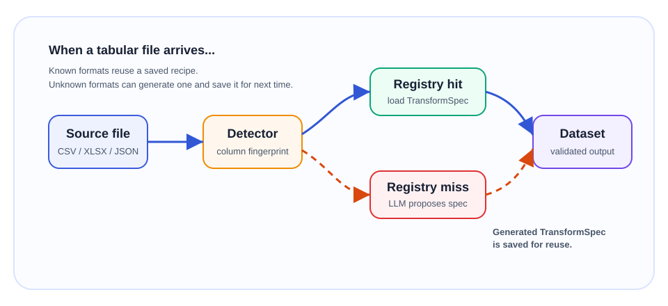

# schemashift

Declarative file format transformer with schema validation and a safe expression DSL.

Enterprise software deployments often depend on loading canonical datasets from client source systems, but those systems export whatever they want: third-party flat files, formats you have never seen before, and arbitrary Excel workbooks. Wiring each one up by hand means bespoke pandas or Polars code for every integration.

**schemashift** solves this with a reusable `DatasetSchema`, source-specific `TransformSpec` files, and a closed DSL that compiles to Polars expressions. When a new source format arrives, `smart_transform()` can detect an existing transform or ask an LLM to generate one and validate it before saving.



## Thirty-second example

**1. Define what you want out:**

```yaml
# examples/schemas/bank_statement.yaml
name: bank_statement
columns:
  transaction_id:
    type: string
    nullable: false
  posted_at:
    type: date
    nullable: false
  description:
    type: string
    nullable: false
  amount:
    type: number
    nullable: false
  currency:
    type: string
    nullable: false
  account_id:
    type: string
    nullable: false
  data_source:
    type: string
    nullable: false
```

**2. Write a transform for one source format:**

Riverbank provides debit and credit columns separately:

```json
{
  "name": "riverbank_statement",
  "description": "Riverbank current account statement export",
  "schema_name": "bank_statement",
  "columns": [
    { "target": "transaction_id", "source": "Ref" },
    { "target": "posted_at", "expr": "col('Date').str.to_datetime('%Y-%m-%d')", "dtype": "date" },
    { "target": "description", "source": "Details" },
    {
      "target": "amount",
      "expr": "col('Credit').cast('float64').fill_null(0) - col('Debit').cast('float64').fill_null(0)",
      "dtype": "number"
    },
    { "target": "currency", "constant": "GBP" },
    { "target": "account_id", "constant": "RIVER-001" },
    { "target": "data_source", "constant": "riverbank" }
  ]
}
```

Metro Credit provides a tab-separated card export with already-signed amounts. That transform lives next to the Riverbank one in `examples/transforms/`.

**3. Transform:**

```python
import schemashift as ss

registry = ss.FileSystemRegistry("./examples/transforms/")
schema = ss.DatasetSchema.from_yaml("examples/schemas/bank_statement.yaml")
result = ss.smart_transform("riverbank_statement.csv", registry=registry, dataset_schema=schema)

df = result.valid
```

## When a new format arrives

If a transform is saved in the registry, schemashift reloads it instantly. Otherwise, if an LLM is provided, it generates a `TransformSpec`, validates it end-to-end, and can save it for next time.

```python
import schemashift as ss
from langchain_anthropic import ChatAnthropic

schema = ss.DatasetSchema.from_yaml("examples/schemas/bank_statement.yaml")
registry = ss.FileSystemRegistry("./examples/transforms/")
llm = ChatAnthropic(model="claude-haiku-4-5-20251001", temperature=0)

result = ss.smart_transform(
    "metro_credit_statement.tsv",
    registry=registry,
    dataset_schema=schema,
    llm=llm,
    auto_register=True,
)
```

## Install

Requires Python 3.12+.

```bash
# Core library
pip install schemashift

# With LLM transform generation
pip install "schemashift[llm]"
```

## CLI

```bash
# Transform with an explicit TransformSpec
schemashift transform riverbank_statement.csv --config examples/transforms/riverbank_statement.json --output result.csv

# Auto-detect format from a transform registry
schemashift transform riverbank_statement.csv --registry ./examples/transforms/ --output result.csv

# Validate a TransformSpec
schemashift validate examples/transforms/riverbank_statement.json

# Generate a transform for an unknown file
schemashift generate data.csv --dataset-schema examples/schemas/bank_statement.yaml --output new_transform.json

# Generate with interactive review before saving
schemashift generate data.csv --registry ./examples/transforms/ --dataset-schema examples/schemas/bank_statement.yaml --interactive
```

## Expression DSL

Column mappings support a safe, closed expression language that compiles to native Polars expressions:

```text
col('Amount') / 1000
col('Name').str.strip().str.lower()
col('Date').str.to_datetime('%Y-%m-%d')
col('dt').dt.year()
when(col('Type') == 'refund', 'Refund').otherwise('Spend')
coalesce(col('Credit'), col('Debit'), 0)
col('Amount').cast('float64')
col('Code').str.replace_regex('\\d+', 'NUM')
```

No `eval()`, no arbitrary Python, only explicitly allowlisted operations.

## Config reference

Each `ColumnMapping` requires exactly one of `source`, `expr`, or `constant`. The `dtype` field casts the result; `fillna` fills nulls after the mapping is applied. Persisted transforms may set `schema_name` to reference a `DatasetSchema` in a registry, while runtime calls can pass a `DatasetSchema` directly with `dataset_schema=...`.

Supported dtype names include Polars names such as `str`, `int64`, `float64`, and `bool`, plus JSON Schema primitive aliases `string`, `integer`, `number`, and `boolean`. JSON Schema container types `array` and `object` are not supported.

## Supported file formats

| Format | Reader |
|--------|--------|
| CSV | `pl.scan_csv` (lazy) |
| TSV | `pl.scan_csv` with `separator="\t"` |
| Parquet | `pl.scan_parquet` (lazy) |
| XLSX / XLS | `pl.read_excel` via fastexcel (eager, then lazy) |
| JSON | `pl.read_json` (eager, then lazy) |
